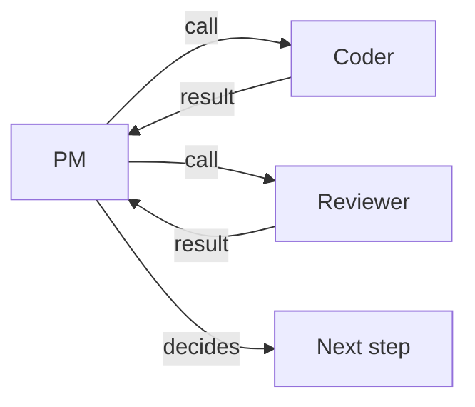
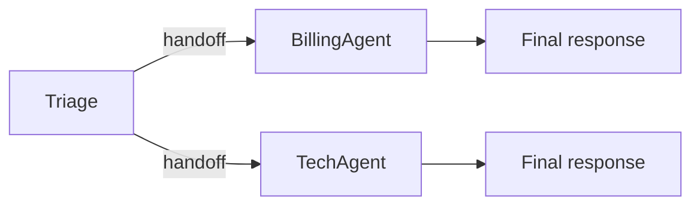
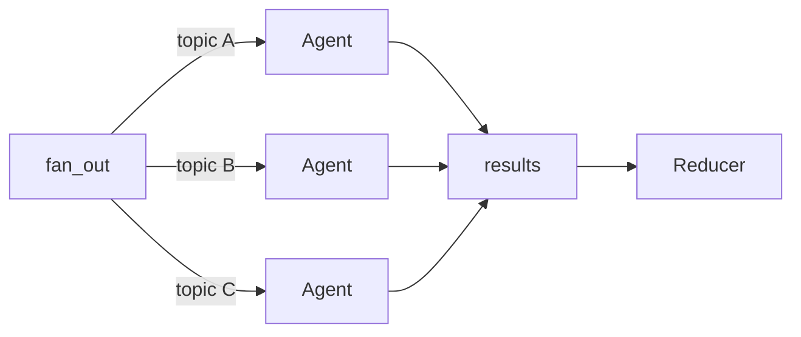
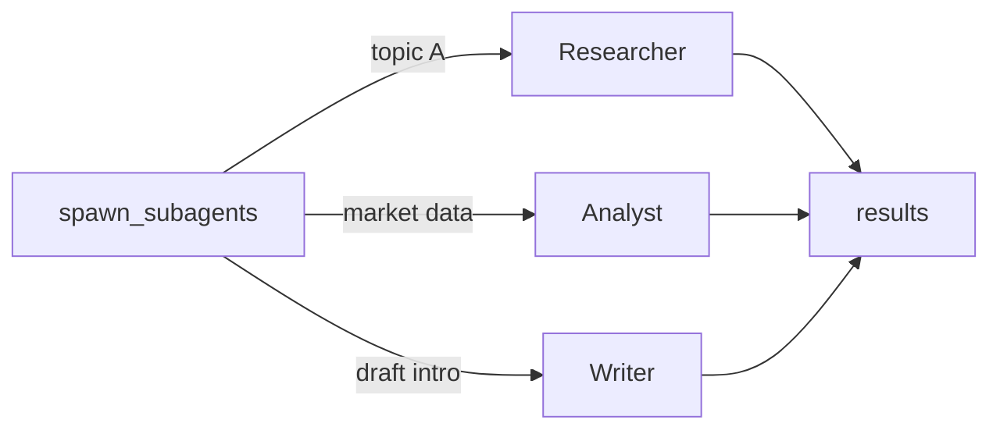
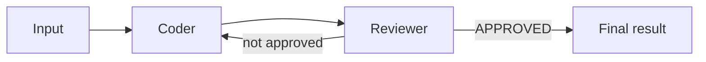

# Multi-Agent Patterns {#Multi-Agent-Patterns}

NimbleAgents provides six primitives for coordinating multiple agents. This page explains each pattern, when to use it, and how they compose — plus what&#39;s not yet supported.

## Supported Patterns {#Supported-Patterns}

### 1. Orchestrator-Workers (`agent_as_tool`) {#1.-Orchestrator-Workers-agent_as_tool}

A central orchestrator delegates tasks to specialist agents and collects their results. The orchestrator **keeps control** throughout — subagents are just tool calls.




```julia
coder    = Agent(name="Coder",    instructions="Write code.", tools=[...])
reviewer = Agent(name="Reviewer", instructions="Review code.")

session = Session()

pm = Agent(
    name         = "PM",
    instructions = "Route coding to Coder, reviews to Reviewer.",
    tools        = [
        agent_as_tool(coder;    session),
        agent_as_tool(reviewer; session),
    ],
)

# PM calls Coder, gets result, calls Reviewer, gets result, responds
run!(pm, "Write a fibonacci function and review it"; session)
```


**When to use:** The orchestrator needs to see all results, make decisions between steps, or combine outputs from multiple specialists.

**Key properties:**
- Orchestrator stays in its `run!` loop the entire time
  
- Subagent calls are regular tool calls — the LLM decides the order
  
- Subagents can be called multiple times or in any sequence
  
- If the LLM requests multiple agent-tool calls in one response, they execute in **parallel**
  
- All turns appear in the shared session
  


---


### 2. Triage / Routing (`handoff_tool` + `run_pipeline!`) {#2.-Triage-/-Routing-handoff_tool-run_pipeline!}

A triage agent examines the request and **transfers control** to the right specialist. The specialist takes over completely.




```julia
billing = Agent(name="Billing", instructions="Handle billing questions.")
tech    = Agent(name="Tech",    instructions="Handle technical issues.")

triage = Agent(
    name         = "Triage",
    instructions = "Route billing to Billing, technical to Tech.",
    tools        = [handoff_tool(billing), handoff_tool(tech)],
)

result = run_pipeline!(triage, "I was charged twice";
                       session=Session(), max_handoffs=5)
```


**When to use:** The first agent only classifies/routes — it doesn&#39;t need to see the specialist&#39;s result.

**Key properties:**
- Control **transfers away** — the triage agent&#39;s `run!` ends when it hands off
  
- `run_pipeline!` detects the `Handoff` and re-runs with the target agent
  
- Supports **chaining**: Agent A → B → C (each agent can hand off to the next)
  
- `max_handoffs` prevents infinite loops
  


---


### 3. Declarative Sub-Agents (`sub_agents` field) {#3.-Declarative-Sub-Agents-sub_agents-field}

Shorthand for pattern 2. The `sub_agents` field auto-generates `handoff_tool`s:

```julia
triage = Agent(
    name       = "Triage",
    sub_agents = [billing, tech],
    # Automatically gets handoff_to_Billing and handoff_to_Tech tools
)

result = run_pipeline!(triage, "My API key isn't working")
```


Equivalent to manually creating `handoff_tool(billing)` and `handoff_tool(tech)`. Use `sub_agents` for convenience when you don&#39;t need custom handoff names or descriptions.


---


### 4. Fan-Out / Map-Reduce (`fan_out`) {#4.-Fan-Out-/-Map-Reduce-fan_out}

Run the **same agent** against multiple inputs, optionally in parallel, with an optional reducer:




```julia
summaries = fan_out(researcher, ["AI safety", "quantum computing", "fusion energy"];
                    parallel = true,
                    session  = session)

# With a reducer — combine into a single string
report = fan_out(researcher, topics;
                 parallel = true,
                 reducer  = (acc, x) -> acc * "\n\n" * string(x))
```


**When to use:** Same task, multiple inputs — like researching several topics, summarizing several documents, or processing a batch.


---


### 5. Heterogeneous Parallel (`spawn_subagents`) {#5.-Heterogeneous-Parallel-spawn_subagents}

Run **different agents** with **different inputs**, optionally in parallel:




```julia
results = spawn_subagents([
    (researcher, "Find facts about X"),
    (analyst,    "Analyze the market for X"),
    (writer,     "Draft an intro for X"),
]; parallel=true, session=session)

# Then feed combined results to an editor
final = run!(editor, join(string.(results), "\n\n"); session)
```


**When to use:** Different specialists, different tasks, all independent — like the planning phase of a research pipeline.


---


### 6. Collaborative Loop (`loop_pipeline!`) {#6.-Collaborative-Loop-loop_pipeline!}

Run agents in **round-robin** order, feeding each agent&#39;s output as the next agent&#39;s input, until a termination condition is met:




```julia
coder    = Agent(name="Coder",    instructions="Write code based on the task.")
reviewer = Agent(name="Reviewer", instructions="Review code. Say APPROVED if good.")

result = loop_pipeline!(
    [coder, reviewer],
    "Write a fibonacci function";
    max_rounds = 5,
    stop_when  = (agent, result) -> occursin("APPROVED", string(result)),
    session    = Session(),
)
```


**When to use:** Iterative refinement — coding + review, drafting + editing, research + fact-checking. Any workflow where agents take turns improving an output until a quality threshold is met.

**Key properties:**
- Agents execute in the order given, one at a time
  
- Each agent receives the previous agent&#39;s output as its input
  
- `stop_when(agent, result)` is checked after every individual agent run — the loop can stop mid-round
  
- `max_rounds` prevents infinite loops (default `5`)
  
- All turns appear in the shared session
  


---


## Composing Patterns {#Composing-Patterns}

These primitives compose naturally. A real pipeline might use several:

```julia
# Step 1: spawn_subagents — plan queries in parallel
queries = spawn_subagents(
    [(planner, topic) for topic in sub_topics];
    parallel=true, session,
)

# Step 2: fan_out — research all queries in parallel
research = fan_out(researcher, string.(queries);
                   parallel=true, session)

# Step 3: orchestrator-workers — draft then edit
pm = Agent(
    tools = [agent_as_tool(drafter; session), agent_as_tool(editor; session)],
)
final = run!(pm, "Draft a report from this research: $(join(research, "\n"))"; session)
```


See [`examples/multi_agent/research_pipeline.jl`](https://github.com/whanyu1212/NimbleAgents.jl/blob/develop/examples/multi_agent/research_pipeline.jl) for a full working example.


---


## Choosing a Pattern {#Choosing-a-Pattern}

|                                           I want to... |                                         Use |
| ------------------------------------------------------:| -------------------------------------------:|
|            Have a central agent coordinate specialists |      `agent_as_tool` (orchestrator-workers) |
|              Classify and route to a single specialist |   `handoff_tool` + `run_pipeline!` (triage) |
|            Process multiple inputs with the same agent |                                   `fan_out` |
|                Run different agents on different tasks |                           `spawn_subagents` |
|     Iterative refinement (code + review, draft + edit) |                            `loop_pipeline!` |
|                                Chain agents: A → B → C | `handoff_tool` chaining via `run_pipeline!` |
|               Call subagents and combine their results |     `agent_as_tool` (orchestrator sees all) |
| Delegate to an external CLI agent (Claude Code, Codex) |    `ExternalAgentTool` / `claude_code_tool` |


---


## Multi-Step Orchestration {#Multi-Step-Orchestration}

The orchestrator-workers pattern naturally supports multi-step flows where the orchestrator calls subagents in sequence, passing results between them:

```julia
pm = Agent(
    name = "PM",
    instructions = """You manage a code delivery pipeline:
1. Send coding tasks to Coder
2. Send Coder's output to Reviewer for review
3. If Reviewer finds issues, send back to Coder with feedback
4. Report the final result""",
    tools = [
        agent_as_tool(coder;    session),
        agent_as_tool(reviewer; session),
    ],
    max_iterations = 10,  # allow multiple rounds
)

run!(pm, "Write and review a fibonacci function"; session)
# PM → Coder → PM → Reviewer → PM → Coder (fix) → PM → Reviewer (approve) → PM
```


The LLM decides the flow — it can call subagents in any order, multiple times, based on the results it receives. This effectively gives you a **review loop** without any special loop primitive, because the orchestrator&#39;s `run!` loop naturally iterates.


---


## Chained Handoffs {#Chained-Handoffs}

Specialists can hand off to other specialists, creating multi-hop routing:

```julia
l1 = Agent(name="L1", instructions="Handle simple questions. Escalate complex ones.",
           tools=[handoff_tool(l2)])
l2 = Agent(name="L2", instructions="Handle complex questions. Escalate critical ones.",
           tools=[handoff_tool(l3)])
l3 = Agent(name="L3", instructions="Handle critical escalations.")

triage = Agent(name="Triage", tools=[handoff_tool(l1)])

# Triage → L1 → L2 → L3 (if needed)
result = run_pipeline!(triage, "Our entire database is down";
                       max_handoffs=5)
```


::: warning Circular Handoffs

If Agent A can hand off to Agent B and Agent B can hand off back to Agent A, they could loop indefinitely. The only protection is `max_handoffs`. Design your handoff topology as a DAG (directed acyclic graph) when possible.

:::


---


## Handoff History Filtering {#Handoff-History-Filtering}

When handing off between agents, you can control what conversation history the receiving agent sees using `HandoffFilter`. This prevents downstream agents from being confused by irrelevant tool calls or earlier context.

### Built-in Filters {#Built-in-Filters}

|           Filter |                                   Description |
| ----------------:| ---------------------------------------------:|
| `:all` (default) |                   Pass full history unchanged |
|          `:none` |  Clear history — receiving agent starts fresh |
|   `:strip_tools` | Remove all tool-call and tool-result messages |
|        `:last_n` |                 Keep only the last N messages |


```julia
# Strip tool messages before handoff
billing = Agent(name="Billing", instructions="Handle billing.")
triage  = Agent(
    name  = "Triage",
    tools = [handoff_tool(billing; history_filter=HandoffFilter(:strip_tools))],
)

# Keep only last 3 messages
handoff_tool(billing; history_filter=HandoffFilter(:last_n, 3))

# Clear history entirely
handoff_tool(billing; history_filter=HandoffFilter(:none))
```


### Custom Filter Function {#Custom-Filter-Function}

For full control, pass a function that transforms the message vector:

```julia
# Keep only user messages
handoff_tool(billing; history_filter=HandoffFilter(
    msgs -> filter(m -> m isa PT.UserMessage, msgs)
))
```


History filtering is applied by `run_pipeline!` when a handoff occurs — the session&#39;s history is replaced with the filtered version before the target agent runs.


---


## Not Yet Supported {#Not-Yet-Supported}

The following patterns are available in other frameworks but not yet implemented in NimbleAgents:

### Graph / DAG Orchestration {#Graph-/-DAG-Orchestration}

**What:** Define an arbitrary directed graph where each node is an agent and edges are conditional routing functions. Nodes can have typed shared state, conditional edges, and cycles with explicit termination conditions.

**Available in:** LangGraph (`StateGraph`, `add_conditional_edges`)

**Workaround:** Use the orchestrator-workers pattern — the LLM acts as the router. For simple conditional routing, use `handoff_tool` with a triage agent. For explicit control flow, write Julia code:

```julia
result = run!(coder, task; session)
if needs_review(result)
    result = run!(reviewer, result; session)
end
```


### Checkpoint / Resume {#Checkpoint-/-Resume}

**What:** Snapshot the full state at each step. If a step fails, resume from the last checkpoint instead of re-running everything.

**Available in:** LangGraph (checkpointing with SQLite/Postgres backends)

**Workaround:** Use session persistence (`JSONSessionStore` or `SQLiteSessionStore`) to save state between steps manually. Full automatic checkpointing is not supported.

### Peer-to-Peer Routing {#Peer-to-Peer-Routing}

**What:** Subagents can directly call other subagents without going through the orchestrator.

**Workaround:** Not recommended. Use the orchestrator-workers pattern instead — the orchestrator sees all results and makes better routing decisions. If you need it, you can give subagents `agent_as_tool` references to each other, but this risks unbounded recursion.
